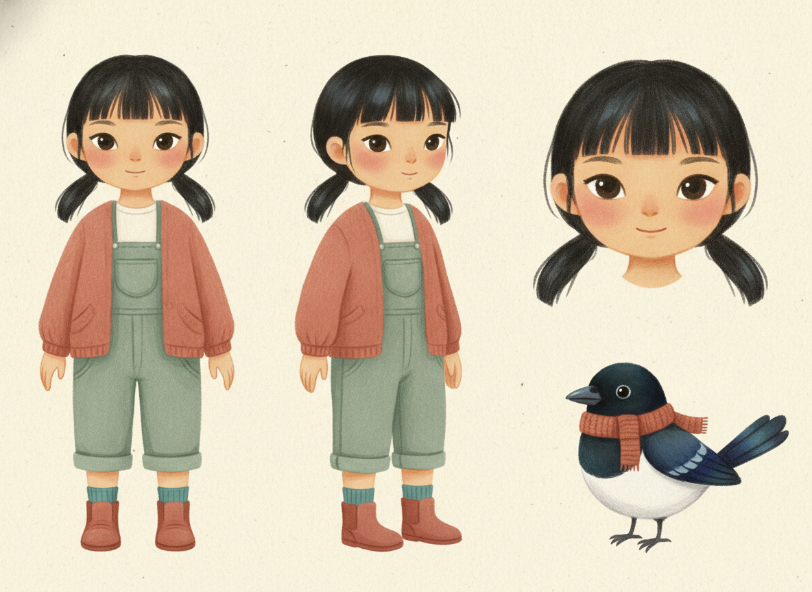
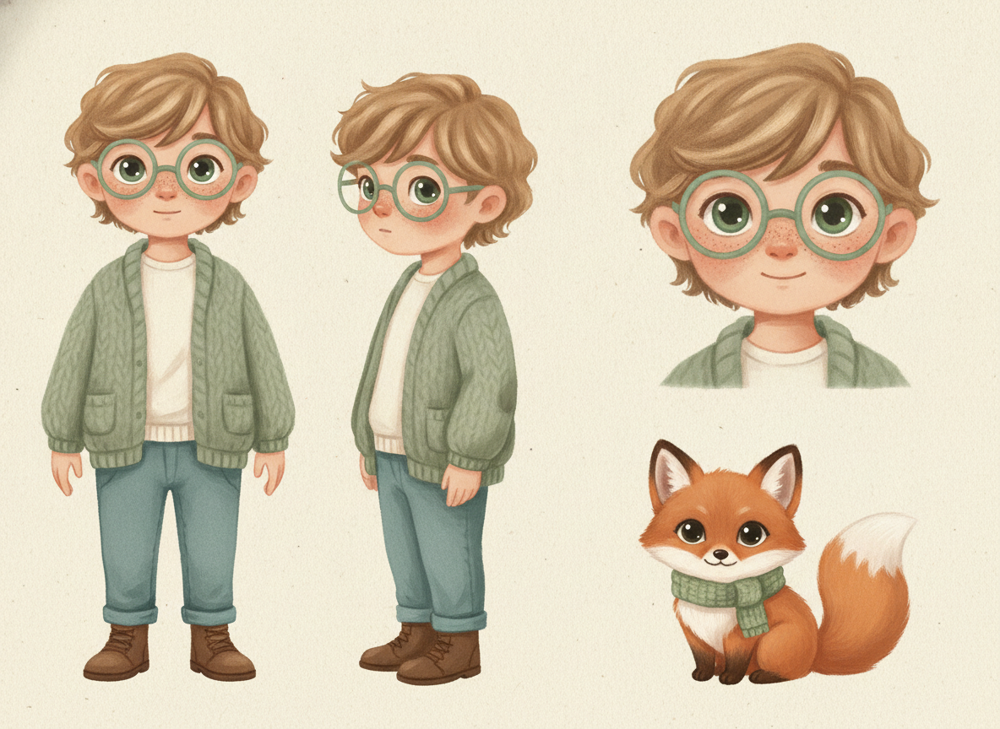
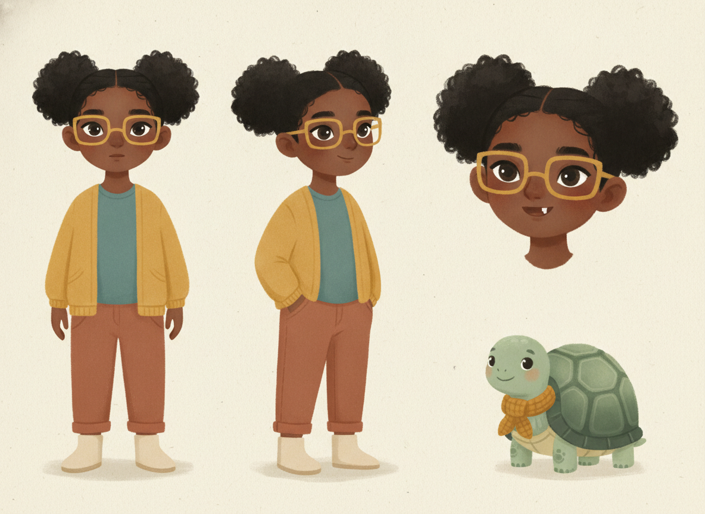

# Slice 2 verification — the guided look picker

Not a spike. This is the evidence for the Week 2 slice that replaced Spike A's
hand-written character prompts with a picker a parent can actually use.

The question Spike A left open: **its prompts were written by hand.** The Mia and
Yuna descriptors were tuned over several attempts by someone who had read the
failure modes. A parent gets one go and cannot see the prompt. So the picker has
to reach the same quality from structured choices alone.

## Method

Three children were assembled the way the app assembles them — option values
only, through `validateChoices` → `buildIdentityDescriptor` → `buildSheetPrompt`
in `supabase/functions/_shared/character.ts` — and rendered on
`gemini-2.5-flash-image`, the same model the pages use.

The three were chosen to break it, not to flatter it:

| | why this one |
|---|---|
| **Yuna**, Korean girl, monolids, blunt fringe, mole under the left eye | ADR-0001's first real user, and the case Spike A step 4 could only pass with hand-tuned wording |
| **Theo**, boy, round glasses, freckles | every page prompt said "her" until this slice — a boy is the regression test |
| **Ama**, neutral presentation, coily hair, deep brown skin, gap tooth | the combination most likely to be flattened toward a generic cartoon |

## Result — 3 / 3

Every sheet came back with three consistent views plus the companion, in the
gouache house style, with no lettering, at ~7–8s and $0.039 each. Skin, hair
texture, hair style, fringe, eye colour, eye shape, glasses shape, glasses
colour, the signature colour and the companion were all honoured, and each
child's colour carried through to their companion's scarf without being asked
for twice.

Yuna is the one that matters: monolids, a blunt fringe and low pigtails, no
anime drift, and a face specific enough to be a particular child — from twelve
taps rather than a hand-written paragraph.

## The one miss

**Yuna's mole did not get drawn.** Everything else on her sheet is correct; the
one fine detail is absent.

This is exactly what Spike A predicted — small features are the first thing a
model drops — and it is the reason the picker offers a distinguishing detail at
all. The field is a drift alarm: a parent who picks a mole has something they
can check in two seconds, on this sheet and on every page drawn from it.

Working as intended, then, but it means the detail is **not** reliable on the
first draw. "Draw another" is one tap, and re-drawing is free before any page
has been illustrated. Worth watching across more sheets before deciding whether
the detail needs its own repetition in the prompt.

## Reproducing

`metrics.json` holds the latency, byte size and the exact descriptor for each
sheet.

The harness, `verify-picker.ts`, rendered through the `spike-a` Edge Function.
**That bridge has since been deleted** — it was reachable with the public anon
key and spent money at a paid provider, which is the hole issue #6 was about.
The script is kept as the record of exactly how these sheets were produced; to
re-run it today, point it at `lock-character` with a signed-in session, which is
the path the app actually uses.

The same applies to the Python harnesses in the Spike A, C and D directories:
they call Edge Functions that no longer exist. They are history, not tooling.
